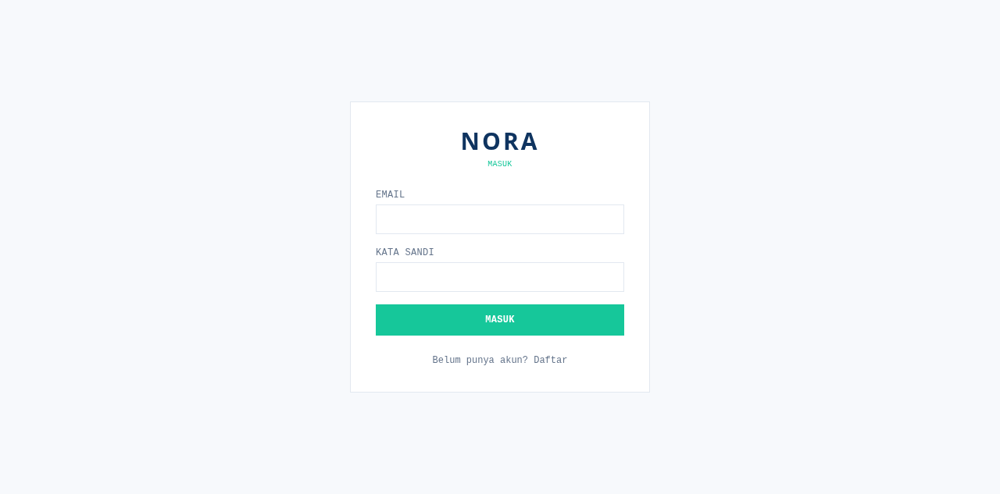
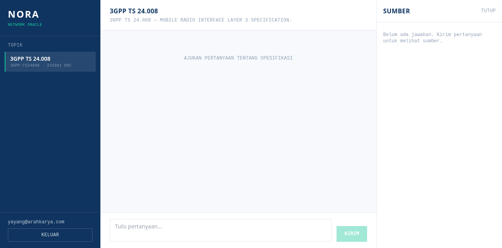
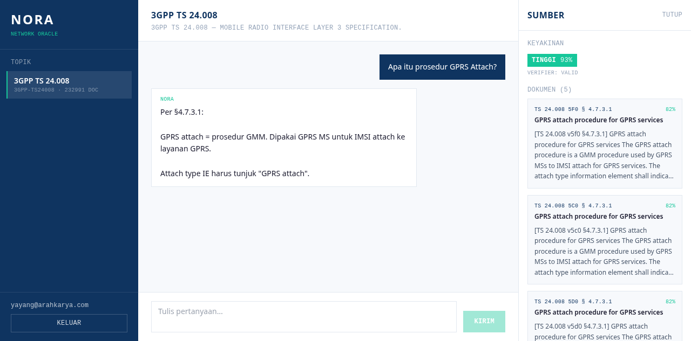

<div align="center">

# NORA — Network Oracle for Reliable Answers

**Reliable answers, grounded in the spec.**

[](https://nora.arahkarya.com)
[](https://github.com/ArahKarya/nora)
[](LICENSE)
[](https://www.python.org/)
[](https://www.trychroma.com/)
[](https://hermes-agent.nousresearch.com/)

</div>

> SaaS AI Research Engine **multi-topik** untuk standar telekomunikasi.
> Kolaborasi **NOZ × PT Arah Karya Sinergi**.

Jawaban teknis telco yang **tergrounded pada spec resmi** (anti-halusinasi), dengan **confidence score** dan **sumber per-section** — diorkestrasi oleh **Hermes Agent**, ditenagai **dual-model** (Opus generator + Sonnet verifier).

NORA adalah **platform multi-topik**: tiap **Topik** = knowledge base standar telco independen (collection sendiri, metode RAG identik). User pilih Topik → bertanya. **Topik pertama yang live: 3GPP TS 24.008.**

## 📚 Topik

| Topik | Status | Domain |
|---|---|---|
| **3GPP TS 24.008** | 🟢 **Live** (terbukti E2E) | NAS L3 — MM / GMM / CC / SM |
| 3GPP TS 23.501 | ⚪ Planned | 5G System Architecture |
| 3GPP TS 33.501 | ⚪ Planned | 5G Security |
| ITU-T (Q/X) | ⚪ Planned | Signalling & data networks |
| IEEE 802.x | ⚪ Planned | LAN / Wireless |
| GSMA / O-RAN | ⚪ Planned | Operator & Open RAN |

Nambah Topik baru = registrasi metadata + ingest knowledge base. **Tanpa ubah kode engine.**

---

## 📸 Tampilan

> 🟢 **Live:** [nora.arahkarya.com](https://nora.arahkarya.com) — multi-tenant login, akses publik via Cloudflare tunnel.

| Login | Workspace |
|---|---|
|  |  |
| Auth per-user (JWT, httpOnly cookie) | Layout 3-kolom: **Topik · Chat · Sumber** |

**Jawaban tergrounded + panel sumber + confidence score:**



> Q: *"Apa itu prosedur GPRS Attach?"* → jawaban cite **§4.7.3.1**, **KEYAKINAN TINGGI 93%**, **VERIFIER: VALID**, 5 sumber dengan similarity score.

---

## ✨ Kenapa NORA

| Masalah | Solusi NORA |
|---|---|
| LLM umum mengarang jawaban telco | **Grounded** ke spec 3GPP resmi, tolak jawab kalau di luar lingkup |
| Tidak ada bukti / sumber | Tiap jawaban bawa **section reference** (§4.7.3.1) + similarity score |
| Tidak tahu seberapa percaya | **Confidence score** (HIGH/MEDIUM/LOW) dari verifier independen |
| Versi spec berubah tiap rilis | Indeks **257 versi** TS 24.008 (R98 1999 → R18 2026), filter per-versi |
| Butuh banyak domain standar | **Multi-topik** — satu engine, banyak knowledge base (3GPP, ITU-T, IEEE, ...) |

## 🏛️ Arsitektur

```
Next.js Dashboard  ──REST──►  FastAPI Backend  ──►  Hermes Core (orkestrasi)
  (pilih Topik)                                      ├─ Topic Registry (3GPP / ITU-T / ...)
                                                     ├─ ChromaDB (1 collection per Topik)
                                                     ├─ Embedding: Gemini (via 9router, dim 3072)
                                                     ├─ Generator: Opus  (via 9router)
                                                     └─ Verifier:  Sonnet (via 9router)
Knowledge base per Topik. Topik #1 = 3GPP TS 24.008 — 257 versi, chunked per-section
```

## 🔁 Pipeline (1 query)

```
query → embed → retrieve top-K → Generator (Opus)
      → Verifier (Sonnet) → validate → loop jika INVALID
      → { answer, confidence, sources }
```

## 📁 Struktur Repo

```
nora/
├── docs/
│   ├── screenshots/       # tampilan UI (login, workspace, jawaban)
│   └── *.md / *.pdf       # BRD, PRD, proposal deck
├── backend/
│   └── nora/
│       ├── ingest/        # chunk per-section + embed → ChromaDB
│       ├── rag/           # retrieval + vector store
│       ├── engine/        # LLM/embed adapter (9router default, ollama swap)
│       ├── pipeline/      # orkestrasi: gen → verify → validate → loop
│       ├── auth/          # JWT + bcrypt (security.py)
│       ├── db/            # SQLAlchemy models (Postgres, multi-tenant)
│       └── api/           # FastAPI routes (auth, topics, query, sessions)
├── frontend/              # Next.js 14 dashboard (auth context, sources panel)
└── docker-compose.yml     # Postgres + backend + frontend
```

## ✅ Status

- [x] Knowledge base 257 versi TS 24.008 terkumpul (778 MB → 229 MB .txt)
- [x] BRD, PRD, proposal deck lengkap (`docs/`)
- [x] **Fase 1 — RAG core terbukti E2E** 🎉 (Topik #1: 3GPP TS 24.008)
  - Chunker section-aware (1051 chunk/versi)
  - Embedding Gemini via 9router (dim 3072, RAM-aman)
  - Dual-model: Opus generator + Sonnet verifier
  - Confidence scoring + anti-halusinasi
- [x] **Fase 2 — API + auth** (FastAPI, JWT + bcrypt, multi-tenant)
- [x] **Fase 3 — SaaS dashboard** (Next.js 14, topic selector, sources panel, confidence badge)
- [x] **Fase 4 — Production deploy** 🚀 — Docker Compose (Postgres + backend + frontend), live di [nora.arahkarya.com](https://nora.arahkarya.com) via Cloudflare tunnel
- [ ] Fase 5: multi-topik aktif (Topik #2+), reset password, Qdrant swap (opsional)

### Bukti E2E (live)

> **Q:** "Apa itu prosedur GPRS Attach?"
> → jawaban teknis akurat cite **§4.7.3.1**, **confidence 0.93 VALID**, 5 sumber dengan §section.
>
> **Q jebakan:** "Harga iPhone 17?"
> → *"Informasi tidak ditemukan dalam spec."* — **menolak mengarang**.

## ⚙️ Config Engine (swap cloud ↔ lokal)

Semua via env (lihat `backend/nora/engine/config.py`):

| Env | Default | Fungsi |
|---|---|---|
| `NORA_ENGINE` | `9router` | engine LLM (`9router` \| `ollama`) |
| `NORA_GEN_MODEL` | `cc/claude-opus-4-8` | generator |
| `NORA_VERIFY_MODEL` | `cc/claude-sonnet-4-6` | verifier |
| `NORA_EMBED_MODEL` | `gemini/gemini-embedding-001` | embedding (dim 3072) |
| `NORA_EMBED_BACKEND` | `9router` | `9router` (cloud) \| `local` (fastembed) |

## 🚀 Quickstart

```bash
cd backend
python -m venv .venv && source .venv/bin/activate
pip install -r requirements.txt

# ingest (butuh 9router jalan di localhost:20128)
python -m nora.ingest.run --limit 1     # test 1 versi
python -m nora.ingest.run               # semua 257 versi

# tanya
python -m nora.ask "Apa itu prosedur GPRS Attach?"
```

> **Catatan multi-topik:** CLI saat ini beroperasi pada Topik #1 (3GPP TS 24.008). Antarmuka `--topic` (registry + selector) menyusul di Fase 3 — lihat `docs/PRD-NORA.md` §F0 & §7 (API).

### 🐳 Full-stack (Docker)

```bash
# 3 service: Postgres + FastAPI backend + Next.js frontend
docker compose up -d --build

# frontend  → http://localhost:3030  (proxy /api → backend, same-origin)
# backend   → http://localhost:8010  (FastAPI, JWT auth)
# postgres  → localhost:5440         (multi-tenant: user + session + history)
```

Produksi expose lewat **Cloudflare tunnel** → [nora.arahkarya.com](https://nora.arahkarya.com) (frontend `:3030`, request `/api/*` di-rewrite ke backend internal — 1 origin, cookie aman, tanpa CORS).

---

<div align="center">
<sub>© 2026 PT Arah Karya Sinergi × NOZ — dibangun dengan Hermes Agent</sub>
</div>
